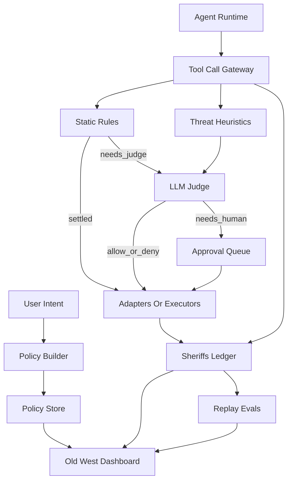

# AgentSheriff — Shared Context (READ FIRST)

This file is the ground truth for the whole project. If a detail here conflicts with a per-person spec, this file wins.

## Product in one line

AgentSheriff is a local policy gateway for agent tool calls. It sits between an agent runtime and the tools that agent wants to use, evaluates each action with deterministic rules first and a prompted LLM judge second, optionally asks a human for approval, records the full decision trail, and exposes the whole system through an Old-West-themed dashboard.

## Product shape

The old three-scene demo still matters, but it is no longer the full product definition.

The core product is now:

1. A **general tool-call gateway** that can sit in front of OpenClaw or any compatible agent runner.
2. A **policy system** made of editable static rules plus an editable natural-language judge prompt.
3. A **policy bootstrap flow** where the user describes what they use the agent for and the system generates a starter ruleset plus judge guidance.
4. A **human approval path** for borderline or high-risk actions.
5. A **replay eval system** that runs historical ledger entries against a draft policy before the user publishes it.

## User journey

The intended product loop is:

1. The user says what the agent is for.
2. AgentSheriff generates an initial policy bundle:
   - static restrictions
   - judge prompt
   - default approval thresholds
3. The user edits and publishes that policy.
4. The agent sends tool calls through `POST /v1/tool-call`.
5. AgentSheriff decides `allow`, `deny`, or `approval_required`.
6. Every action is written to the Sheriff's Ledger.
7. The user inspects audit history, tunes policies, and runs evals before publishing tighter rules.

## Demo and verification

The three existing scenarios remain the primary smoke test and the most compelling live demo:

1. `good` — a normal task is allowed.
2. `injection` — a malicious or exfiltration-shaped task is denied.
3. `approval` — a borderline task pauses for human approval, then continues when approved.

These scenarios are now **verification assets and demo flows**, not the full product definition.

## Architecture



## Decision pipeline

Every `POST /v1/tool-call` follows the same shape:

1. Normalize the incoming tool call.
2. Compute heuristic signals and a heuristic risk score.
3. Evaluate static rules in order.
4. If a static rule settles the decision, use it.
5. Otherwise call the LLM judge with:
   - the active policy prompt
   - normalized tool metadata
   - the tool arguments
   - recent context
   - heuristic summary
6. Optionally branch to human approval when the matched rule or judge result requires it.
7. If allowed, dispatch to the adapter layer.
8. Persist the decision, reasoning, and execution result to the ledger.
9. Stream updates to the dashboard.

## Tech stack (locked for MVP)

- **Backend:** Python 3.11, FastAPI, Pydantic v2, SQLAlchemy 2.x, SQLite, `uv`
- **Frontend:** Next.js 15, TypeScript, Tailwind, shadcn/ui, Zustand, React Query, `react-use-websocket`
- **LLM path:** Anthropic SDK with prompt caching
- **Agent integration:** OpenClaw first, but the gateway contract should be generic
- **Demo packaging:** Docker Compose

## Explicit non-goals for MVP

These are inspired by CrabTrap, but out of scope for the first merge:

- transparent HTTP/HTTPS MITM proxying
- TLS certificate generation
- forcing agent traffic through `HTTP_PROXY` / `HTTPS_PROXY`
- PostgreSQL as a requirement
- full auth and tenancy
- replacing the Python backend with Go

## Repo layout (authoritative)

```text
/
├── backend/
│   ├── pyproject.toml
│   ├── uv.lock
│   ├── sheriff.db
│   └── src/agentsheriff/
│       ├── __init__.py
│       ├── main.py
│       ├── config.py
│       ├── gateway.py
│       ├── streams.py
│       ├── models/
│       │   ├── dto.py
│       │   └── orm.py
│       ├── policy/
│       │   ├── engine.py
│       │   ├── store.py
│       │   ├── builder.py
│       │   └── templates/
│       ├── threats/
│       │   ├── detector.py
│       │   ├── classifier.py
│       │   └── evaluator.py
│       ├── audit/
│       │   └── store.py
│       ├── approvals/
│       │   └── queue.py
│       ├── adapters/
│       │   ├── __init__.py
│       │   ├── manifest.py
│       │   └── ...
│       ├── api/
│       │   ├── tool_calls.py
│       │   ├── policies.py
│       │   ├── approvals.py
│       │   ├── audit.py
│       │   ├── evals.py
│       │   ├── agents.py
│       │   └── health.py
│       └── demo/
│           ├── deputy_dusty.py
│           └── scenarios/
├── frontend/
│   ├── package.json
│   └── src/
│       ├── app/
│       ├── components/
│       └── lib/
├── demo/
│   ├── docker-compose.yml
│   ├── openclaw-config/
│   └── README.md
├── specs/
├── implementation/
└── README.md
```

## Core API contracts

### `POST /v1/tool-call`

This is the stable ingress contract for any agent integration.

Request:

```json
{
  "agent_id": "deputy-dusty",
  "agent_label": "Deputy Dusty",
  "tool": "gmail.send_email",
  "args": {
    "to": "accountant@example.com",
    "subject": "Q1 invoice",
    "attachments": ["invoice_q1.pdf"]
  },
  "context": {
    "task_id": "task-123",
    "source_prompt": "Send the invoice to accounting",
    "source_content": "Latest email thread or page text",
    "conversation_id": "conv-1"
  }
}
```

Response:

```json
{
  "decision": "allow",
  "reason": "Matched rule policy.finance.internal_send",
  "risk_score": 32,
  "matched_rule_id": "policy.finance.internal_send",
  "judge_used": false,
  "policy_version_id": "pv_123",
  "audit_id": "audit_456",
  "approval_id": null,
  "user_explanation": null,
  "result": {
    "status": "sent"
  }
}
```

Notes:

- `decision` is one of `allow`, `deny`, `approval_required`.
- `matched_rule_id` is nullable when the LLM judge made the final call.
- `judge_used` indicates whether the LLM path ran.
- `policy_version_id` must always be present for traceability.
- `approval_id` is present only when a pending approval exists or was just resolved through the blocking request path.
- the gateway always responds with HTTP 200 for valid requests, even when the decision is `deny`

### `GET /v1/policies`

List policy versions and summary metadata.

### `POST /v1/policies`

Create a new draft policy version.

### `POST /v1/policies/generate`

Generate a starter policy from a user intent description.

### `POST /v1/policies/{id}/publish`

Publish a draft version.

### `GET /v1/evals`

List eval runs.

### `POST /v1/evals`

Create an eval run that replays historical audit entries against a policy version.

### `GET /v1/evals/{id}`

Return aggregate stats and run metadata.

### `GET /v1/evals/{id}/results`

Return row-level eval results.

### `POST /v1/approvals/{id}`

Resolve an approval with `approve`, `deny`, or `redact`.

### `WS /v1/stream`

Server pushes real-time frames for:

- audit entries
- approval lifecycle
- agent state changes
- policy publish events
- eval progress
- heartbeat

## Policy model

An active policy version contains:

- metadata: `id`, `name`, `version`, `status`, `created_at`, `published_at`
- a user-authored `intent_summary`
- a `judge_prompt`
- ordered `static_rules`
- approval defaults and thresholds

Static rules support:

- exact tool match or namespace match
- optional argument predicates
- actions: `allow`, `deny`, `require_approval`, `delegate_to_judge`
- optional severity clamps
- explanation text for the user and ledger

## Audit and eval expectations

The ledger is not just a history table. It is also the source for replay evaluation.

Each audit entry must retain enough information to replay a policy decision later:

- tool name
- normalized args snapshot
- context snapshot
- heuristic signals and score
- matched rule id
- whether the judge ran
- judge rationale
- final decision
- approval outcome if any
- execution result summary
- policy version used

## Scenario assets

`good`, `injection`, and `approval` stay in the repo and must remain stable. They are required for:

- local smoke tests
- demo rehearsals
- UI development
- fallback verification when the full general flow is not yet wired

## Definition of done

The merged architecture is considered complete when all of the following are true:

1. A user can describe what they use an agent for and receive a starter policy draft.
2. A draft policy can be edited, versioned, and published.
3. Tool calls flow through the gateway and are decided by static rules first and the judge second.
4. Borderline actions can require human approval without bypassing the ledger.
5. Historical ledger rows can be replayed against a draft policy via eval runs.
6. The dashboard surfaces live activity, policies, approvals, and eval results.
7. The three demo scenarios still work end to end.

## Global non-negotiables

- No real third-party side effects in adapters during MVP.
- All timestamps are UTC ISO-8601 strings.
- Prompt caching is mandatory on repeated LLM calls.
- The gateway remains useful without the LLM path enabled.
- SQLite is the MVP store; Postgres is a later upgrade, not an implied current dependency.
- Approval is a first-class capability and must not be dropped to mirror CrabTrap.
